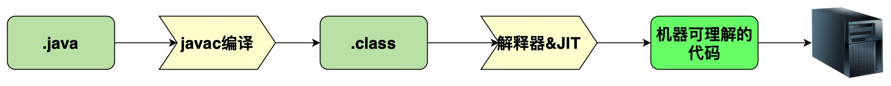
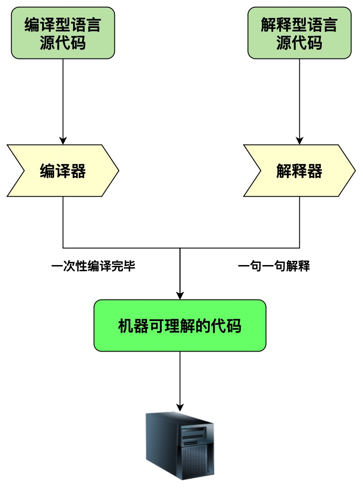
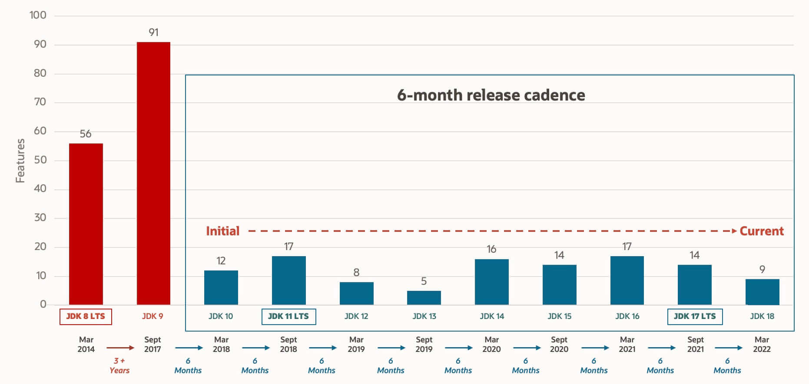
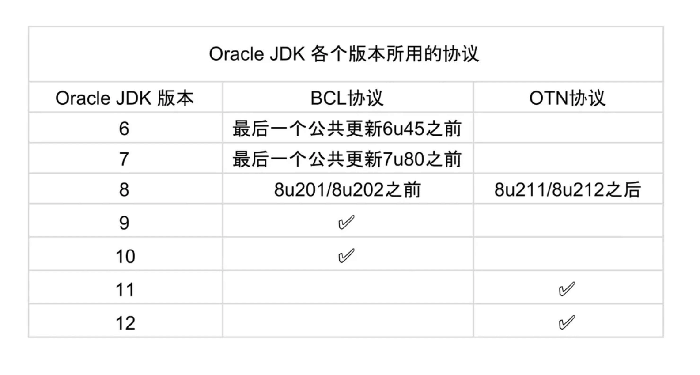

# 基础

## 1、基础概念
### 1.1、特点
- 简单易学
- 面向对象（封装、继承、多态）
- 平台无关性（跨平台：Write Once, Run Anywhere）
- 支持多线程
- 可靠性
- 安全性
- 支持简单易用的网络编程能力
- 编译与解释并存

### 1.2、概念（JVM vs JDK vs JRE）

#### 1.2.1、JVM
&emsp;&emsp;Java虚拟机（JVM）是运行在Java字节码的虚拟机，JVM有针对不同操作系统的特定实现（Windows，MacOS，Linux），目前是使用相同的字节码，他们会给出相同的结果，字节码和不同操作系统的JVM是现实 “Write Once, Run Anywhere” 的关键所在
<br />&emsp;&emsp;<strong style="color:#9090fa">JVM并不只有一种，只要满足JVM规范，每个公司，组织或者个人都可以开发自己的专属JVM，也就是说我们平时结束到 HotSpot VM 只是 JVM规范的一种实现而已</strong>
<br />&emsp;&emsp;除了最常用的 HotSpot VM外，还有 J9 VM、Zing VM、JRockit VM 等VM，维基百科上有常见JVM对比 [Comparison of Java virtual machines](https://en.wikipedia.org/wiki/Comparison_of_Java_virtual_machines) ，各个版本JVM规范可以参照 [Java SE Specifications](https://docs.oracle.com/javase/specs/index.html)

#### 1.2.2、JDK
&emsp;&emsp;**JDK**是 <strong style="color:#9090fa">Java Development Kit</strong> 缩写，它是功能齐全的 Java SDK，它拥有 JRE所拥有的一切，还有编译器（javac）和工具（如：javadoc，jdb），它能够创建和编译程序，一般开发者电脑中会安装JDK

#### 1.2.3、JRE
&emsp;&emsp;**JRE**是Java运行时环境，它是运行已编译Java程序所需的所有内容集合，包括Java虚拟机（JVM），Java类库，Java命令，和其他的一些基础构建，但是它不能用户创建新程序
<br />&emsp;&emsp;<strong style="color:#9090fa">概述：简而言之，JRE只能用于运行编译后的程序，未经过编译的程序是无法通过JRE运行的，因此开发者都只能使用JDK作为基础环境进行开发，而生成环境中则可使用JRE作为基础环境</strong>

### 1.3、字节码
在Java中，JVM可以理解的代码就叫做<cite style="color:#bd7575">字节码</cite>（即扩展名为 <strong style="color:#9090fa">.class</strong> 的文件），他不面向任何特定的处理器，只面向JVM虚拟机。Java语言通过字节码的方式，在一定程度上解决了传统解释型语言执行效率低的问题，同时又保留了解释型语言可移植的特点，所以Java程序运行时相对来说还是高效的（不过与C++，Rust，Go等语言还是有一定差距的）。而且字节码不针对某一特定机器，因此Java程序无需重新编译即可在多种不同操作系统上运行

&emsp;&emsp;其中 .class => 机器码 在这一步JVM类加载器首先加载字节码文件，然后通过解释器逐行解释执行，这种方法的执行速度相对会比较慢，而且有些方法和代码块是经常需要被调用的（也就是所谓的热点代码），所以后面引入了 JIT（just-in-time compilation）编译器，当JIT编译器完成第一次编译后，其会将字节码对应的机器码保存下来，下次可以直接使用，而我们知道，机器码的运行效率肯定是高于Java解析器的，这也解释了我们为什么经常会说 <strong style="color:#9090fa">Java是编译与解释共存的语言</strong>
<div style="color:#4e4edc;background:#dcfff1">&emsp;&emsp;HotShot采用了惰性评估（Lazy Evaluation）的做法，根据二八定律，消耗大部分系统资源的只有那一小部分代码（热点代码），二者也就是 JIT 所需要编译的部分，JVM会根据代码每次被执行的情况收集信息并相应的做出一些优化，因为执行的次数越多，它的速度就越快，JKD9引入了新的编译模式 AOT（Ahead of Time Compilation），它是直接将字节码编译成机器码，这样就避免了 JIT 预热等个方面的开销，JDK支持分层编译和AOT协作使用</div>

### 1.4、为什么不全采用AOT
<div>&emsp;&emsp;既然AOT可以提前编译为机器码，节省启动时间，为什么不全部使用 AOT 这种编译方式呢？</div>
<br/><div>&emsp;&emsp;这其实和Java现有的生态有些关系，例如：CGLIB动态代理使用的是ASM技术，而这种技术大致原理是运行时直接在内存中生成并加载修改后的 <strong style="color:#9090fa">字节码（.class）</strong>文件，如果全部使用 AOT 提前编译，也就不能使用ASM技术了，为了支持类似的动态特性，因此依旧选择使用 JIT 即时编译.</div>

### 1.5、“编译和解释并存” 是为什么？
先说说我们对高级编程语言的分类，按照执行方式可以分为两种
- 编译型：编译型语言会通过编译器将源代码一次性翻译成可被平台执行的机器码，一般情况下，编译语言执行速度比较快，开发效率比较低，常见的编译型语言有 C、C++、Go、Rust等
- 解释型：解释型语言会通过解释器一句句的将代码解释为机器代码后再执行，解释性语言开发效率比较快，执行速度比较慢，常见的解释型语言有 Python、JavaScript、PHP等
  

**根据维基百科介绍**
> 为了改善编译语言的效率而发展出的 [即时编译](https://zh.wikipedia.org/wiki/%E5%8D%B3%E6%99%82%E7%B7%A8%E8%AD%AF) 技术，已经缩小了这两种语言间的差距，这种技术混合了编译语言与解释型语言的优点，它像编译语言一样，先把程序源代码编译成[字节码](https://zh.wikipedia.org/wiki/%E5%AD%97%E8%8A%82%E7%A0%81)，到执行期时，再讲字节码直译，之后执行。Java 与 [LVVM](https://zh.wikipedia.org/wiki/LLVM) 就是这种技术的代表产物，

### 1.6、OracleJDK vs OpenJDK
&emsp;&emsp;现在公司里面很多使用OpenJDK了，因为OracleJDK收费嘛，虽然这么使用，相信很多人都不知道 OpenJDK和OracleJDK的区别吧。
<br/>&emsp;&emsp;对于 Java7 其实并没有什么区别，OpenJDK是基于 SUN 公司捐赠的 HotSpot 源码实现，此外，OpenJDK被选为Java7的参考实现，被Oracle工程师维护

---

**总结（网上摘抄的一些素材）：**
1. Oracle JDK 大概每 6 个月发一次主要版本（从 2014 年 3 月 JDK 8 LTS 发布到 2017 年 9 月 JDK 9 发布经历了长达 3 年多的时间，所以并不总是 6 个月），而 OpenJDK 版本大概每三个月发布一次。但这不是固定的，我觉得了解这个没啥用处。详情参见：[https://blogs.oracle.com/java-platform-group/update-and-faq-on-the-java-se-release-cadenceopen](https://blogs.oracle.com/java-platform-group/update-and-faq-on-the-java-se-release-cadenceopen)
2. OpenJDK 是一个参考模型并且是完全开源的，而 Oracle JDK 是 OpenJDK 的一个实现，并不是完全开源的；（个人观点：众所周知，JDK 原来是 SUN 公司开发的，后来 SUN 公司又卖给了 Oracle 公司，Oracle 公司以 Oracle 数据库而著名，而 Oracle 数据库又是闭源的，这个时候 Oracle 公司就不想完全开源了，但是原来的 SUN 公司又把 JDK 给开源了，如果这个时候 Oracle 收购回来之后就把他给闭源，必然会引起很多 Java 开发者的不满，导致大家对 Java 失去信心，那 Oracle 公司收购回来不就把 Java 烂在手里了吗！然后，Oracle 公司就想了个骚操作，这样吧，我把一部分核心代码开源出来给你们玩，并且我要和你们自己搞的 JDK 区分下，你们叫 OpenJDK，我叫 Oracle JDK，我发布我的，你们继续玩你们的，要是你们搞出来什么好玩的东西，我后续发布 Oracle JDK 也会拿来用一下，一举两得！）OpenJDK 开源项目：[https://github.com/openjdk/jdkopen](https://github.com/openjdk/jdkopen)
3. Oracle JDK 比 OpenJDK 更稳定（肯定啦，Oracle JDK 由 Oracle 内部团队进行单独研发的，而且发布时间比 OpenJDK 更长，质量更有保障）。OpenJDK 和 Oracle JDK 的代码几乎相同（OpenJDK 的代码是从 Oracle JDK 代码派生出来的，可以理解为在 Oracle JDK 分支上拉了一条新的分支叫 OpenJDK，所以大部分代码相同），但 Oracle JDK 有更多的类和一些错误修复。因此，如果您想开发企业/商业软件，我建议您选择 Oracle JDK，因为它经过了彻底的测试和稳定。某些情况下，有些人提到在使用 OpenJDK 可能会遇到了许多应用程序崩溃的问题，但是，只需切换到 Oracle JDK 就可以解决问题；
4. 在响应性和 JVM 性能方面，Oracle JDK 与 OpenJDK 相比提供了更好的性能；
5. Oracle JDK 不会为即将发布的版本提供长期支持（如果是 LTS 长期支持版本的话也会，比如 JDK 8，但并不是每个版本都是 LTS 版本），用户每次都必须通过更新到最新版本获得支持来获取最新版本；
6. Oracle JDK 使用 BCL/OTN 协议获得许可，而 OpenJDK 根据 GPL v2 许可获得许可。
 ::: tip 既然 Oracle JDK 这么好，那为什么还要有 OpenJDK？
  答：   
    1. OpenJDK 是开源的，开源意味着你可以对它根据你自己的需要进行修改、优化，比如 Alibaba 基于 OpenJDK 开发了 Dragonwell8：[https://github.com/alibaba/dragonwell8open](https://github.com/alibaba/dragonwell8open)  
    2. OpenJDK 是商业免费的（这也是为什么通过 yum 包管理器上默认安装的 JDK 是 OpenJDK 而不是 Oracle JDK）。虽然 Oracle JDK 也是商业免费（比如 JDK 8），但并不是所有版本都是免费的。  
    3. OpenJDK 更新频率更快。Oracle JDK 一般是每 6 个月发布一个新版本，而 OpenJDK 一般是每 3 个月发布一个新版本。（现在你知道为啥 Oracle JDK 更稳定了吧，先在 OpenJDK 试试水，把大部分问题都解决掉了才在 Oracle JDK 上发布）  

  基于以上这些原因，OpenJDK 还是有存在的必要的！
 :::


   
      
**🌈 拓展一下：**
- BCL 协议（Oracle Binary Code License Agreement）： 可以使用 JDK（支持商用），但是不能进行修改。
- OTN 协议（Oracle Technology Network License Agreement）： 11 及之后新发布的 JDK 用的都是这个协议，可以自己私下用，但是商用需要付费。
  
  相关阅读 👍：[《Differences Between Oracle JDK and OpenJDK》](https://www.baeldung.com/oracle-jdk-vs-openjdk)


## 2、基本语法

### 2.1、注释的几种用法

<CodeGroup>
  <CodeGroupItem title="文档注释" active>

```bash
/**
 * 获取名称（文档注释）
 * @return String
 */
public void getName() {
}
```

  </CodeGroupItem>

  <CodeGroupItem title="多行注释">

```bash
public void getName() {
    /*
     * 多行注释
     */
    String a = "";
}
```

  </CodeGroupItem>

  <CodeGroupItem title="单行注释">

```bash
public void getName() {
    // 单行注释
    return "foo";
}
```

  </CodeGroupItem>
</CodeGroup>

::: warning From 《Clean Code》
&emsp;&emsp;代码的注释不是越详细越好。实际上好的代码本身就是注释，我们要尽量规范和美化自己的代码来减少不必要的注释。
  <br/>若编程语言足够有表达力，就不需要注释，尽量通过代码来阐述。
:::


### 2.2、“关键字”
&emsp;&emsp;[官方文档](https://docs.oracle.com/javase/tutorial/java/nutsandbolts/_keywords.html)

<table>
    <tr>
        <th>分类</th>
        <th colspan="7">关键字</th>
    </tr>
    <tr>
        <td>访问控制</td>
        <td>private</td>
        <td>protected</td>
        <td>public</td>
        <td></td>
        <td></td>
        <td></td>
    </tr>
    <tr>
        <td rowspan="3">类,变量,方法修饰符</td>
        <td>abstract</td>
        <td>class</td>
        <td>extends</td>
        <td>final</td>
        <td>implements</td>
        <td>interface</td>
    </tr>
    <tr>
        <td>native</td>
        <td>new</td>
        <td>static</td>
        <td>strictfp</td>
        <td>synchronized</td>
        <td>transient</td>
    </tr>
    <tr>
        <td>volatile</td>
        <td>enum</td>
        <td></td>
        <td></td>
        <td></td>
        <td></td>
    </tr>
    <tr>
        <td rowspan="3">程序控制</td>
        <td>break</td>
        <td>continue</td>
        <td>return</td>
        <td>do</td>
        <td>while</td>
        <td>if</td>
    </tr>
    <tr>
        <td>else</td>
        <td>for</td>
        <td>instanceof</td>
        <td>switch</td>
        <td>case</td>
        <td>default</td>
    </tr>
    <tr>
        <td>assert</td>
        <td></td>
        <td></td>
        <td></td>
        <td></td>
        <td></td>
    </tr>
    <tr>
        <td>错误处理</td>
        <td>try</td>
        <td>catch</td>
        <td>finally</td>
        <td>throw</td>
        <td>throws</td>
        <td></td>
    </tr>
    <tr>
        <td>包相关</td>
        <td>import</td>
        <td>package</td>
        <td></td>
        <td></td>
        <td></td>
        <td></td>
    </tr>
    <tr>
        <td rowspan="2">基本类型</td>
        <td>byte</td>
        <td>char</td>
        <td>int</td>
        <td>float</td>
        <td>double</td>
        <td>long</td>
    </tr>
    <tr>
        <td>boolean</td>
        <td>short</td>
        <td></td>
        <td></td>
        <td></td>
        <td></td>
    </tr>
    <tr>
        <td>变量引用</td>
        <td>super</td>
        <td>this</td>
        <td>void</td>
        <td></td>
        <td></td>
        <td></td>
    </tr>
    <tr>
        <td>保留字</td>
        <td>goto</td>
        <td>const</td>
        <td></td>
        <td></td>
        <td></td>
        <td></td>
    </tr>
</table>

### 2.3、自增、自减运算符
**关键字：** <strong style="color:#93934d">++</strong>  <strong style="color:#93934d;margin-left:10px">--</strong>
```java
int a = 1;
System.out.print(a++); // 输出 1
System.out.print(a);   // 输出 2

int b = 1;
System.out.print(++b); // 输出 2
System.out.print(b);   // 输出 2

口诀：“符号在前就先加/减，符号在后就后加/减”
```

### 2.4、continue、break、return 区别
- **`continue`**:  跳出单次循环，继续下一次循环
- **`break`**:  结束循环体，继续循环后的代码
- **`return`**:  跳出所在方法，结束该方法的运行


### 2.5、变量
#### 2.5.1、成员变量 与 局部变量
- 语法形式 ：
    - 成员变量属于类，而局部变量是在代码块或方法中定义的变量或方法的参数。
    - 成员变量可以被 public，private，static 等修饰符修饰，但是局部变量则不可被这些修饰符修饰，但是两个都可被 final 修饰符修饰
- 存储方式 ：
    - 如果成员变量被static修饰，该变量是属于类的，如果没有static修饰，该成员变量属于实例
    - 对象存在于堆内存，局部变量存在于栈内存
- 生存时间 ：
    - 从变量的生存时间上来说，成员变量是对象的一部分，随对象的创建而存在，局部变量随着方法的调用而生成，随方法调用结束而消亡
- 默认值：
    - 成员变量如果没有被赋初始值，则会以类型的默认值进行赋值（被final修饰的变量必须显式赋值），局部变量则不会自动赋值

#### 2.5.2、静态变量
- 可以被类的所有实例共享，无论一个类创建多少对象，他们都共享同一份静态变量
- 通常情况下静态变量会被 **`final`** 关键字修饰为常亮

::: tip  字符型 常量和 字符串 常量的区别
1. **`字符`** 常量是由单引号引起的一个字符
2. **`字符串`** 常量是双引号引起的0个或若干个字符
3. 字符常量相当于一个整型值（ASCII值），可以参与表达式运算
4. 字符串常量代表一个地址值（该字符串在内存中存放位置）
5. 占用内存：
   1. 字符常量占 2 个字节（**`char在java中占两个字节`**）
   2. 字符串占若干个字节
:::

### 2.6、方法
::: tip 静态方法为什么不能调用非静态成员
&emsp;&emsp;静态方法属于类，在类加载的时候就会分配内存，可以通过类名直接访问，也可以使用对象直接访问。   
&emsp;&emsp;在类的非静态成员不存在的时候，静态成员已经存在了，此时调用内存中不存在的非静态成员，属于非法操作。
:::

#### 2.6.1、重载
&emsp;&emsp;发生在同一个类中（或者父类和子类之间），**`方法名必须相同`**，**`参数类型不同`**、**`个数不同`**、**`顺序不同`**，方法返回值和访问修饰符可以不同。

::: tip
**《Java 核心技术》这本书是这样介绍重载的：**  
&emsp;&emsp;如果多个方法(比如 StringBuilder 的构造方法)有相同的名字、不同的参数， 便产生了重载。
```java
StringBuilder sb = new StringBuilder();
StringBuilder sb2 = new StringBuilder("HelloWorld");
```
编译器必须挑选出具体执行哪个方法，它通过用各个方法给出的参数类型与特定方法调用所使用的值类型进行匹配来挑选出相应的方法。 如果编译器找不到匹配的参数， 就会产生编译时错误， 因为根本不存在匹配， 或者没有一个比其他的更好(这个过程被称为 **`重载解析`** (overloading resolution))。  
**Java 允许重载任何方法， 而不只是构造器方法。**
:::

> <Badge type="tip" text="TIP" vertical="middle" />  **重载就是同一个类中多个同名方法根据不同的传参来执行不同的逻辑处理。**

#### 2.6.2、重写
&emsp;&emsp;重写发生在运行期，是子类对父类的允许访问的方法的实现过程进行重新编写。
- 方法名、参数列表必须相同，子类方法返回值类型应比父类方法返回值类型更小或相等，抛出的异常范围小于等于父类，访问修饰符范围大于等于父类。
- 如果父类方法访问修饰符为 private/final/static 则子类就不能重写该方法，但是被 static 修饰的方法能够被再次声明。
- 构造方法无法被重写

> <Badge type="tip" text="TIP" vertical="middle" />  **重写就是子类对父类方法的重新改造，外部样子不能改变，内部逻辑可以改变。**
  

#### 2.6.3、区别

<table>
    <tr>
        <th style="width: 80px">区别点</th>
        <th style="width: 65px">重载方法</th>
        <th>重写方法</th>
    </tr>
    <tr>
        <td>发生范围</td>
        <td>同一个类</td>
        <td>子类</td>
    </tr>
    <tr>
        <td>参数列表</td>
        <td>必须修改</td>
        <td>不能修改</td>
    </tr>
    <tr>
        <td>返回类型</td>
        <td>可修改</td>
        <td>子类方法返回类型应该比父类方法返回值类型更小或是相等</td>
    </tr>
    <tr>
        <td>异常</td>
        <td>可修改</td>
        <td>子类方法声明抛出的异常类应该比父类方法声明抛出的异常类更小或是相等</td>
    </tr>
    <tr>
        <td>访问修饰符</td>
        <td>可修改</td>
        <td>一定不能做更严格的限制（可以降低限制）</td>
    </tr>
    <tr>
        <td>发生阶段</td>
        <td>编译期</td>
        <td>运行期</td>
    </tr>
</table>


#### 2.6.4、可变参数
&emsp;&emsp;从 Java5 开始，Java 支持定义可变长参数，所谓可变长参数就是允许在调用方法时传入不定长度的参数。方法可以接受 0 个或者多个参数。

<Badge type="warning" text="注意" vertical="middle" /> **可变参数可固定参数谁优先匹配**

> 答案: 会优先匹配固定参数的方法，因为固定参数的方法匹配度更高。

```java
public class Demo {
    public static void test1(String... args) {
        for (String arg : args) {
            System.out.println(arg);
        }
    }

    public static void test1(String a, String b) {
        System.out.println(a + b);
    }

    public static void main(String[] args) {
        test1("a", "b", "c");
        test1("a", "b");
    }
}
```
输出
```text
a
b
c
ab
```

<Badge type="warning" text="注意" vertical="middle" /> **可变参数和数组参数的区别**

&emsp;&emsp;通过编译后的代码可以看到，可变参数编译后会被转换为一个数组，找到编译后的 **`class`** 文件可以看到以下内容 

```java
public class Demo {
    public static void test1(String... args) {
        String[] var1 = args;
        int var2 = args.length;

        for(int var3 = 0; var3 < var2; ++var3) {
            String arg = var1[var3];
            System.out.println(arg);
        }
    }
}
```

::: danger
**以下两个方法是等价的，不可同时在一个类上定义，不能作为重载方法** <Badge type="danger" text="违法操作" vertical="top" />
```java
public class Demo {
    public static void test1(String... args) {
        
    }

    public static void test1(String[] arr) {
        
    }
}
```
:::

## 3、基本数据类型
### 3.1、Java中的几种基本数据类型是很重要的，你了解几种呢？

Java种有 **8** 种基本数据类型

- **6** 种数字类型：  
  - **4** 种整数类型：**`byte`**、**`short`**、**`long`**
  - **2** 种浮点类型：**`float`**、**`double`**
- **1** 种字符类型：**`char`**
- **1** 种布尔类型：**`boolean`**

<Badge type="tip" text="TIP" vertical="middle" /> 这 8 种基本数据类型的默认值以及所占空间的大小如下：
<table>
    <tr>
        <th>基本类型</th>
        <th>位数</th>
        <th>字节</th>
        <th>默认值</th>
        <th>取值范围</th>
    </tr>
    <tr>
        <td>byte</td>
        <td>8</td>
        <td>1</td>
        <td>0</td>
        <td>-128 ~ 127</td>
    </tr>
    <tr>
        <td>short</td>
        <td>16</td>
        <td>2</td>
        <td>0</td>
        <td>-32768 ~ 32767</td>
    </tr>
    <tr>
        <td>int</td>
        <td>32</td>
        <td>4</td>
        <td>0</td>
        <td>-2147483648 ~ 2147483647</td>
    </tr>
    <tr>
        <td>long</td>
        <td>64</td>
        <td>8</td>
        <td>0L</td>
        <td>-9223372036854775808 ~ 9223372036854775807</td>
    </tr>
    <tr>
        <td>char</td>
        <td>16</td>
        <td>2</td>
        <td>'u0000'</td>
        <td>0 ~ 65535</td>
    </tr>
    <tr>
        <td>float</td>
        <td>32</td>
        <td>4</td>
        <td>0f</td>
        <td>1.4E-45 ~ 3.4028235E38</td>
    </tr>
    <tr>
        <td>double</td>
        <td>64</td>
        <td>8</td>
        <td>0d</td>
        <td>4.9E-324 ~ 1.7976931348623157E308</td>
    </tr>
    <tr>
        <td>boolean</td>
        <td>1</td>
        <td></td>
        <td>false</td>
        <td>true、false</td>
    </tr>
</table>

&emsp;&emsp;对于 boolean，官方文档未明确定义，它依赖于 JVM 厂商的具体实现。逻辑上理解是占用 1 位，但是实际中会考虑计算机高效存储因素。
> &emsp;&emsp;另外，Java 的每种基本类型所占存储空间的大小不会像其他大多数语言那样随机器硬件架构的变化而变化。这种所占存储空间大小的不变性是 Java 程序比用其他大多数语言编写的程序更具可移植性的原因之一（《Java 编程思想》2.2 节有提到）。

::: warning
- 1、注意：Java 里使用 **`long`** 类型的数据一定要在数值后面加上 L，否则将作为整型解析。
- 2、`char a = 'h'`; char :单引号，`String a = "hello"`; :双引号。
    
这八种基本类型都有对应的包装类分别为：**`Byte`**、**`Short`**、**`Integer`**、**`Long`**、**`Float`**、**`Double`**、**`Character`**、**`Boolean`** 。
:::

### 3.2、基本类型和包装类型的区别
- 包装类型不赋值就是`null`，基本类型有默认值且不是`null`。
- 包装类型可用于泛型，基本类型不可以。
- 基本数据类型的局部变量放在Java虚拟机栈中的局部变量表中，基本数据类型的成员变量（未被`static`修饰）存放在Java虚拟机的堆中，包装类型属于对象类型，我们知道几乎所有对象实例都存在于堆中。
- 相比于对象类型，基本数据类型占用的空间非常小。
::: tip
**为什么说几乎所有实例呢？** 这是因为HotSpot虚拟机引入了`JIT`优化之后，会对对象进行逃逸分析，如果发现某一个对象并没有逃逸到方法外部，那么就可能通过标量替换来实现栈上分配，而避免堆上分配内存 
:::

:::warning
:warning: 基本数据类型存放在栈中是一个常见的误区！ 基本数据类型的成员变量如果没有被 static 修饰的话（不建议这么使用，应该要使用基本数据类型对应的包装类型），就存放在堆中。
```java
public class Demo {
  private int a;
}
```
:::

### 3.3、包装类型的缓存机制是什么？
<br/>
&emsp;<Badge type="danger" text="提示" vertical="middle" />: Java 基本数据类型的包装类型大部分都用到了缓存机制来提升性能。

- **`Byte`**、**`Short`**、**`Integer`**、**`Long`** 这四种包装类默认创建了数值 [-128 ~ 127] 的相应类型的缓存数据  
- **`Character`** 创建了数值在 [0 ~ 127] 范围的缓存数据  
- **`Boolean`** 直接返回 `True` or `Flase`  

**缓存源码**

<CodeGroup>
  <CodeGroupItem title="Byte" active>

```java{3,12,13}
public static Byte valueOf(byte b) {
final int offset = 128;
return ByteCache.cache[(int)b + offset];
}

private static class ByteCache {
private ByteCache(){}

    static final Byte cache[] = new Byte[-(-128) + 127 + 1];

    static {
        for(int i = 0; i < cache.length; i++)
            cache[i] = new Byte((byte)(i - 128));
    }
}
```

</CodeGroupItem>
  <CodeGroupItem title="Short">

```java{5,16,17}
public static Short valueOf(short s) {
    final int offset = 128;
    int sAsInt = s;
    if (sAsInt >= -128 && sAsInt <= 127) { // must cache
        return ShortCache.cache[sAsInt + offset];
    }
    return new Short(s);
}

private static class ShortCache {
    private ShortCache(){}

    static final Short cache[] = new Short[-(-128) + 127 + 1];

    static {
        for(int i = 0; i < cache.length; i++)
            cache[i] = new Short((short)(i - 128));
    }
}
```

</CodeGroupItem>
  <CodeGroupItem title="Integer">

```java{3}
public static Integer valueOf(int i) {
    if (i >= IntegerCache.low && i <= IntegerCache.high)
        return IntegerCache.cache[i + (-IntegerCache.low)];
    return new Integer(i);
}
private static class IntegerCache {
    static final int low = -128;
    static final int high;
    static {
        // high value may be configured by property
        int h = 127;
    }
}
```

</CodeGroupItem>
  <CodeGroupItem title="Long">

```java{4,15,16}
public static Long valueOf(long l) {
    final int offset = 128;
    if (l >= -128 && l <= 127) { // will cache
        return LongCache.cache[(int)l + offset];
    }
    return new Long(l);
}
        
private static class LongCache {
    private LongCache(){}

    static final Long cache[] = new Long[-(-128) + 127 + 1];

    static {
        for(int i = 0; i < cache.length; i++)
            cache[i] = new Long(i - 128);
    }
}
```

</CodeGroupItem>
  <CodeGroupItem title="Character">

```java{3,12,13}
public static Character valueOf(char c) {
    if (c <= 127) { // must cache
      return CharacterCache.cache[(int)c];
    }
    return new Character(c);
}

private static class CharacterCache {
    private CharacterCache(){}
    static final Character cache[] = new Character[127 + 1];
    static {
        for (int i = 0; i < cache.length; i++)
            cache[i] = new Character((char)i);
    }
}
```

</CodeGroupItem>
  <CodeGroupItem title="Boolean">

```java
public static Boolean valueOf(boolean b) {
    return (b ? TRUE : FALSE);
}
```

</CodeGroupItem>
</CodeGroup>

::: warning
如果超出对应范围仍然会去创建新的对象，缓存的范围区间大小只是在性能和资源之间的权衡。
:::

**两种浮点数类型的包装类 `Float`、`Double` 并没有实现缓存机制**

**看个示例**
```java
Integer a1 = 11;
Integer b1 = 11;
System.out.println(a1 == b1); // 输出 true

Integer a2 = 200;
Integer b2 = 200;
System.out.println(a2 == b2); // 输出 false

Float a3 = 33f;
Float b3 = 33f;
System.out.println(a3 == b3);// 输出 false

Double a4 = 1.2;
Double b4 = 1.2;
System.out.println(a4 == b4);// 输出 false
```

**让我们来做一道题目试试看**
```java
Integer a = 10;
Integer b = new Integer(10);

System.out.println(a == b);
```

> 解析： `Integer a = 10` 这一行会发生自动装箱，相当于 `Integer a = Integer.valueOf(10)`，因此 `a` 直接使用的是缓存中的对象，而 `Integer b = new Integer(10)` 会直接创建新的对象
> <br/><br/>因此答案是：`false` 你答对了吗？

:::danger
记住，所有包装类对象之间值的比较，全部使用 **`equals`** 方法

:::

### 3.4、自动装箱&拆箱概念和原理

**什么是自动拆装箱**
- **`装箱`**: 将基本类型用他们对应的引用类型包装起来
- **`拆箱`**: 将包装类型转换为基本数据类型

**示例**
```java
Integer a = 10; // 自动装箱 ，等价于  Integer a = Integer.valueOf(10)
int b = a; // 自动拆箱，等价于  int b = a.intValue();
```

:::danger
**注意：如果频繁拆装箱的话，也会严重影响系统的性能。我们应该尽量避免不必要的拆装箱操作。**
```java
private static long sum() {
    // 应该使用 long 而不是 Long
    Long sum = 0L;
    for (long i = 0; i <= Integer.MAX_VALUE; i++) {
        sum += i;
    }
    return sum;
}
```
:::

### 3.5、为什么浮点数运算会有精度丢失的分险？

**浮点数运算精度丢失代码实例**
```java
float a = 2.0f - 1.9f;
float b = 1.8f - 1.7f;

System.out.println(a);// 0.100000024
System.out.println(b);// 0.099999905
System.out.println(a == b);// false
```

**为什么会出现这种问题呢？？？**

> 这个和计算机保存浮点数的机制有很大的关系。我们知道计算机是二进制的，而且计算机在表示一个数字时，宽度是有限的，无线循环的小数存储在计算机时，智能被截断，所以就会导致小数精度发生损失的情况。这也就解释了为什么浮点数没有办法用二进制精确表示。

**就比如说十进制下的`0.2`没办法精确转换成二进制小数：**
```java
// 0.2 转换为二进制的过程为，不断的乘以 2，直到不存在小数为止
// 在这个计算过程中，得到的整数部分从上到下排列就是二进制的结果
0.2 * 2 = 0.4 -> 0
0.4 * 2 = 0.8 -> 0
0.8 * 2 = 1.6 -> 1
0.6 * 2 = 1.2 -> 1
0.2 * 2 = 0.2 -> 0 (发生循环)
...
```

关于浮点数的更多内容，参考 [【浮点数详解】](/coding/other/float.html)

### 3.6、解决浮点数运算精度丢失

&emsp;&emsp;Java提供的 [**`BigDecimal`**](/coding/other/bigdecimal.md) 可以实现对浮点数的运算，不会造成精度丢失。通常情况下，大部分需要浮点数精确运算结果的业务场景（比如涉及到钱的运算场景）都是通过 [**`BigDecimal`**](/coding/other/bigdecimal.md) 来做。

**运算示例：**
```java
BigDecimal a = new BigDecimal("1.0");
BigDecimal b = new BigDecimal("0.9");
BigDecimal c = new BigDecimal("0.8");

BigDecimal x = a.subtract(b);
BigDecimal y = b.subtract(c);

System.out.println(x); /* 0.1 */
System.out.println(y); /* 0.1 */
System.out.println(Objects.equals(x, y)); /* true */
```

### 3.7、超过long类型数据如果表示？
> 基本数值类型都有一个表达范围，如果超过这个范围就会有数值溢出的风险。

**在 Java 中，64 位 long 整型是最大的整数类型。**
```java
long l = Long.MAX_VALUE;
System.out.println(l + 1); // -9223372036854775808
System.out.println(l + 1 == Long.MIN_VALUE); // true
```

**`BigInteger`** 内部使用 int[] 数组来存储任意大小的整形数据。
<br/>相对于常规整数类型的运算来说，**`BigInteger`** 运算的效率会相对较低。